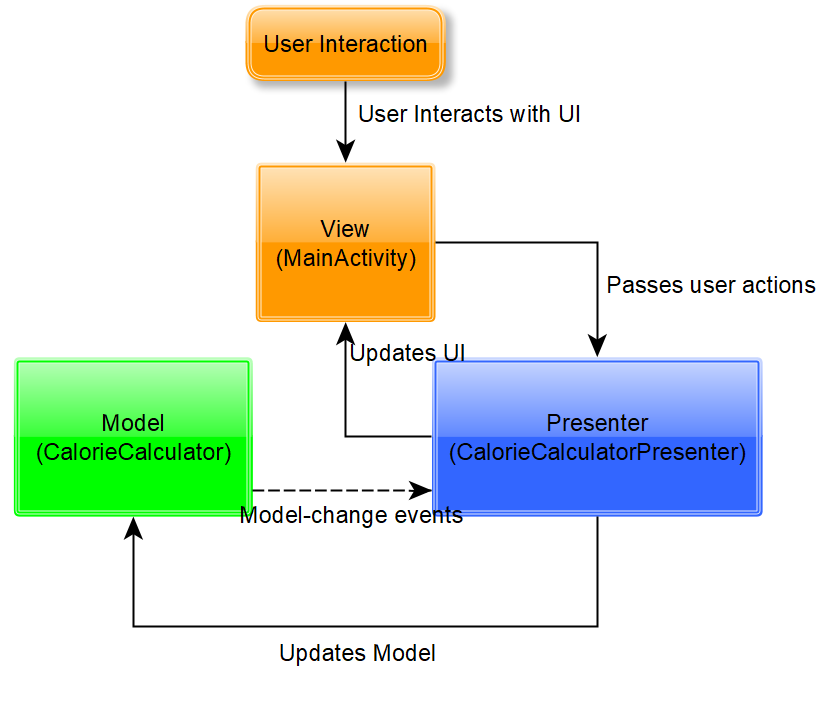

# Excersise 01: MVP
## Name:            Michael Lang
## Student number:  293151
## Course of study: MSI - SE
## Course:          Mobile Computing WS19/20 - HTWG Konstanz

### Use Case:
A User can enter his weight, age, height and activity level to calculate his daily calorie wastage.
### Architecture:

### Why MVP:
Classic MVC controller pattern highly depends on android apis, therefore its difficult to unit test. 
In MVP the presenter has no android api dependency and can be easily tested. Another alternative to MVC is MVVM. 
But MVP seems to be the beginner friendly pattern for the first app with a MVC archtiecture.
